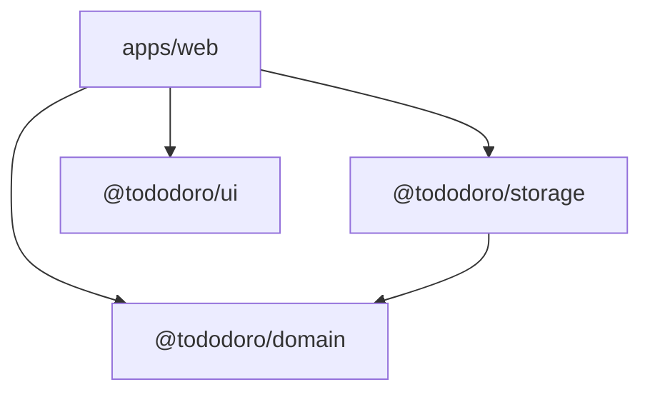

# tododoro

**A mirror, not a manager.** tododoro is a local-first, Pomodoro-enhanced canvas for tracking personal intentions. You don't plan to focus — you focus, then reflect on what it meant.

## Table of Contents

- [Why tododoro](#why-tododoro)
- [Core Concepts](#core-concepts)
- [Features](#features)
- [Tech Stack](#tech-stack)
- [Getting Started](#getting-started)
- [Development](#development)
- [Project Structure](#project-structure)
- [Philosophy](#philosophy)
- [Contributing](#contributing)
- [License](#license)

## Why tododoro

Every productivity tool treats tasks as obligations and time as a resource to manage. tododoro inverts this: attention is an act of devotion, and the app becomes a personal mirror — a record not of what you completed, but of how much of yourself you gave.

Built for people who do slow, invisible, non-linear work — makers, researchers, writers, independent builders — exhausted by tools that reward output volume but never acknowledge presence.

No accounts. No cloud. No nudges. No scores. You are the sole authority on your own achievement.

## Core Concepts

**Constellation Canvas** — Your intentions live on a spatial canvas. Position declares priority. Drag a card to the center and that is what matters now. No tags, no priority fields, no sorting logic.

**Session-First Model** — The Pomodoro session is the core entity. Todos are optional labels that sessions belong to. You can start a session without knowing what you are focusing on. Focus comes first; reflection follows.

**Devotion Record** — Every todo accumulates a visual history of every Pomodoro invested across time. Not a count — a story. *"11 Pomodoros across 9 days"* on something you have been quietly showing up for.

**Release Ritual** — Two kinds of letting go: *"completed its purpose"* and *"was never truly mine."* Releasing something is an act of clarity, not failure.

**The Shelf** — Sealed and released todos live on, with their full Devotion Record and lifecycle history preserved. Nothing disappears.

## Features

- Infinite canvas with drag, zoom, and pan
- Pomodoro timer with analog wipe animation and configurable durations
- Exploration sessions (start focusing without linking to a todo)
- Devotion Record per todo — a timeline of every session invested
- Completion Moment — honours the act of sealing a todo
- The Shelf — browse your full history of sealed and released intentions
- Light, dark, and system-default themes
- Keyboard navigation for all primary controls
- WCAG 2.1 Level AA accessibility
- Durable session state — survives tab close, crash, and device sleep
- Event-sourced persistence with repair pipeline and schema migration
- SQLite in the browser via WebAssembly (OPFS) — no server, no fallback
- Fully offline after first load
- Zero external network calls — enforced by Content Security Policy

## Tech Stack

| Layer | Technology |
|---|---|
| **Framework** | React 19 |
| **Bundler** | Vite 7 |
| **Language** | TypeScript (strict mode) |
| **Monorepo** | Turborepo + pnpm |
| **Canvas** | React Flow |
| **State** | Zustand |
| **Styling** | Tailwind CSS 4 |
| **Persistence** | SQLocal (SQLite via WASM + OPFS) |
| **ORM** | Drizzle ORM |
| **Testing** | Vitest + Testing Library |

## Getting Started

### Prerequisites

- [Node.js](https://nodejs.org/) v18+
- [pnpm](https://pnpm.io/) v8+

### Install and Run

```bash
git clone https://github.com/basteez/tododoro.git
cd tododoro
pnpm install
pnpm dev
```

Open `http://localhost:5173` in a modern browser. tododoro requires OPFS and WebAssembly support (Chrome 109+, Firefox 111+, Safari 16.4+).

### Build for Production

```bash
pnpm build
```

The output is a static bundle in `apps/web/dist/`, deployable to any CDN or static host.

## Development

### Commands

| Command | Description |
|---|---|
| `pnpm dev` | Start all packages in dev mode |
| `pnpm build` | Build all packages |
| `pnpm test` | Run all test suites |
| `pnpm typecheck` | Type-check all packages |
| `pnpm lint` | Lint all packages |
| `pnpm format` | Format all files with Prettier |

### Domain-First Approach

The `@tododoro/domain` package has zero production dependencies and maintains 100% test coverage as a CI gate. All domain logic is pure TypeScript — no framework, no storage, no runtime dependencies. This is the foundation everything else builds on.

### Cross-Origin Isolation

SQLocal requires `Cross-Origin-Embedder-Policy: require-corp` and `Cross-Origin-Opener-Policy: same-origin` headers. These are configured in the Vite dev server and in deployment configuration.

## Project Structure

```text
tododoro/
├── apps/
│   └── web/                  # React SPA entry point
├── packages/
│   ├── domain/               # Pure domain logic (zero deps)
│   ├── storage/              # SQLite persistence via SQLocal + Drizzle
│   ├── ui/                   # Shared UI components
│   ├── eslint-config/        # Shared ESLint configuration
│   └── typescript-config/    # Shared TypeScript configuration
└── PRODUCT_PHILOSOPHY.md     # Non-negotiable design constraints
```

### Package Dependencies



Dependencies flow strictly downward. `@tododoro/domain` imports nothing. Circular imports fail the build.

## Philosophy

tododoro is opinionated by design. Before adding any feature, ask: does this belong in a priority manager, a calendar app, or a gamified habit tracker? If yes, it does not belong here.

- **No due dates.** Time pressure is not part of this product.
- **No priorities.** Spatial position is the entire priority system.
- **No sub-tasks.** A todo is a single, whole intention.
- **No accounts or sync.** All data lives on your device.
- **No gamification.** The Devotion Record is reflective, not motivational.

Read the full constraints in [PRODUCT_PHILOSOPHY.md](PRODUCT_PHILOSOPHY.md).

## Contributing

tododoro welcomes contributions. Before opening a PR, please read [PRODUCT_PHILOSOPHY.md](PRODUCT_PHILOSOPHY.md) to understand the design constraints — they are non-negotiable.

To get started:

1. Fork the repo and create a feature branch
2. Run `pnpm install` and `pnpm test` to verify everything passes
3. Make your changes — `@tododoro/domain` must maintain 100% test coverage
4. Open a PR with a clear description of what changed and why

## License

MIT
