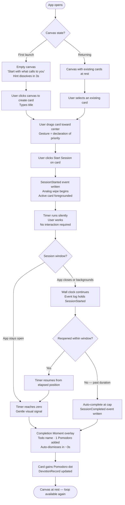
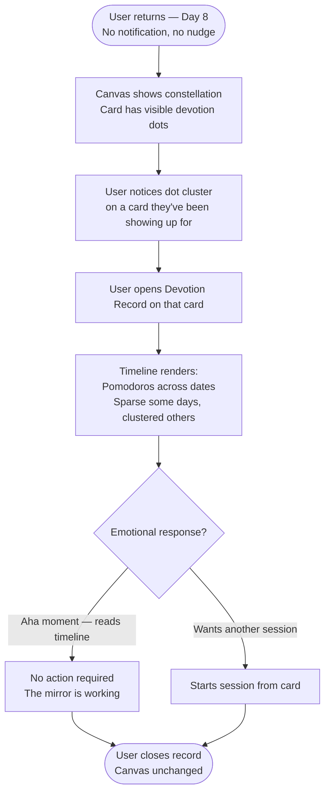
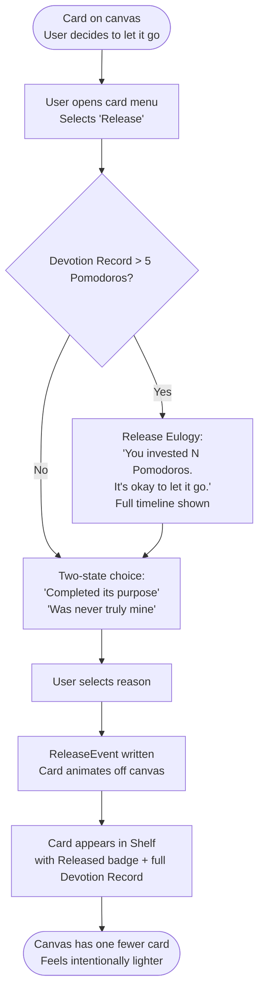
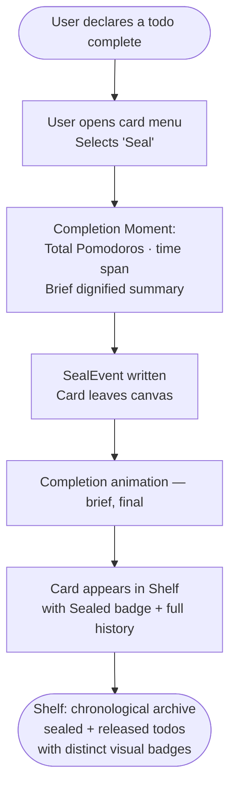
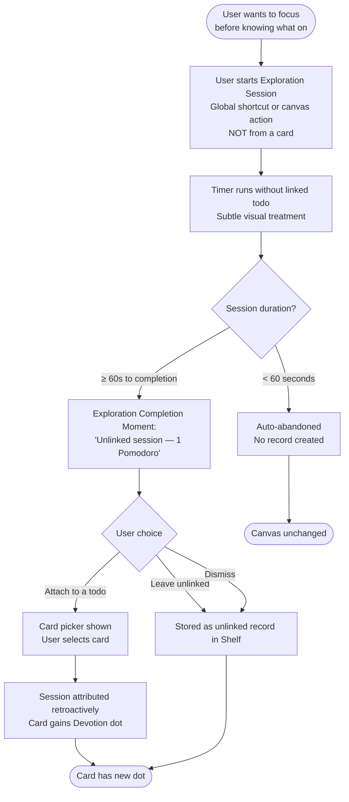

# UX Design Specification — tododoro

**Author:** Tiziano
**Date:** 2026-03-10

---

## Executive Summary

### Project Vision

tododoro is a local-first, Pomodoro-enhanced personal productivity web app built on a philosophical inversion: you don't plan to focus — you focus, then reflect on what it meant. Todos are not obligations to fill with time; they are labels that sessions belong to. The primary entity is the Pomodoro session, not the task.

The product is radically local: no accounts, no cloud, no nudges, no scores. The user is the sole authority on their own achievement. tododoro becomes a personal mirror — a record not just of what was completed, but of how much of oneself was given to each intention.

### Target Users

**Marco — The Tool-Fatigued Maker.** Freelance dev/designer/indie builder. Technically sophisticated, aesthetically discerning, privately exhausted by productivity tools. Lives on HN and maker spaces. His aha moment: seeing "11 Pomodoros across 9 days" on something he's been quietly showing up for. He is the distribution vector — philosophy spreads through him.

**Sofia — The Invisible Worker.** PhD student, writer, independent researcher. Her work is slow, non-linear, produces nothing checkable by conventional metrics. Every tool has shamed her by design. tododoro witnesses her devotion without judgment. She is the philosophical proof — the soul of the product.

Both users are defined not by job title but by their relationship to slow, invisible, non-linear work — and a belief that their attention is worth witnessing.

### Key Design Challenges

1. **The Constellation Canvas is a UX leap.** There is no prior mental model for a spatial canvas as a todo app. It must feel natural within the first 10 seconds — not clever, not diagramming-tool-adjacent. The 10-second test is a hard validation gate.
2. **Zero onboarding with full clarity.** One ambient hint, 3 seconds. The canvas and card metaphor must do all the teaching. This is simultaneously the app's highest risk and its most important design moment.
3. **The Devotion Record must land emotionally, not informationally.** "It counts Pomodoros" is the failure state. The design must frame accumulated presence as something that feels *witnessed*, not tabulated. The visual language of the timeline carries this entire weight.
4. **The Release Ritual requires honesty without friction.** Two release reasons is philosophically essential but must feel clarifying, not burdensome. The distinction between "completed its purpose" and "was never truly mine" is the core of the product's soul — the UI must honor it without making users overthink.
5. **Desktop-first pointer interaction.** The canvas is designed for mouse/trackpad. Drag, pan, zoom must feel fluid and direct — not like a productivity tool wearing a diagramming tool's skin.

### Design Opportunities

1. **The blank canvas as honest onboarding.** An empty canvas with "Start with what calls to you" dissolving in 3 seconds IS the philosophy. Getting this empty state exactly right is the entire first impression and first test of the product's trust.
2. **Completion Moment as ceremony.** Sealing a todo can feel like a genuine ritual — a brief, dignified acknowledgment — not a checkbox. This differentiates tododoro from every other productivity UI and makes completion feel like something worth doing.
3. **The Devotion Record as a genuine emotional object.** If the visual design communicates *weight* — sparse vs. dense, clustered vs. sustained presence — it becomes something users want to return to and share. The aha moment lives entirely in this design.
4. **The Shelf as a personal archive, not a graveyard.** The visual language of sealed vs. released badges, and the way histories are displayed, determines whether users experience the Shelf as a record worth revisiting or a place where things go to be forgotten.

---

## Core User Experience

### Defining Experience

The core interaction loop is: open the canvas → drag the todo that calls to you toward center → start a Pomodoro session from the card → work → session completes → repeat. The single most important action to get right is the canvas drag + session start flow. If this feels awkward or cognitively heavy, nothing else recovers the experience.

### Platform Strategy

Desktop-first SPA, mouse/trackpad primary. Chrome/Firefox/Safari modern (2022+). Tablet as secondary with touch drag support. Mobile explicitly out of scope for v1. PWA installability is post-MVP but architecturally accounted for from day one. Data is already fully local — no cloud fallback exists or is needed.

### Effortless Interactions

- Canvas pan, zoom, and drag must feel like moving objects on a physical surface — not operating a UI
- Adding a new card: click canvas, type, done — near-zero friction
- Starting a session: one deliberate action from the card; then the UI steps back and the timer runs
- Session completion: automatic, no confirmation; the card is updated quietly in the background
- The timer: ambient and trustworthy — something to trust, not monitor

### Critical Success Moments

1. **The first 10 seconds** — empty canvas, hint dissolves; user either knows what to do or doesn't; this is a hard validation gate
2. **First session completion** — single Pomodoro indicator appears on the card; quiet, small, present; first evidence of witnessing
3. **Day 8 — the aha moment** — Devotion Record shows accumulated presence; "11 Pomodoros across 9 days"; no other tool has shown them this
4. **The first Release** — two-state letting go; the distinction must arrive as clarity, not friction
5. **Opening the Shelf** — sealed todos with full histories; the product has become a personal record

### Experience Principles

1. **The session is the act; the todo is the witness.** Focus comes first. Canvas and timer are foreground; todo management is incidental.
2. **The canvas is the product.** All primary actions originate on the canvas. It must feel like a space, not a screen.
3. **The product witnesses, never validates.** tododoro makes no moral judgments. It records. This governs every copy, feedback design, and empty state.
4. **Restraint is the design.** The absence of due dates, priorities, and scores is visible and intentional — whitespace, simplicity, and silence are active design materials.
5. **Invisible durability.** Event sourcing, repair pipeline, and session resilience are entirely hidden. The experience is effortless precisely because the complexity is invisible.

---

## Desired Emotional Response

### Primary Emotional Goals

The central emotion tododoro must create is **being witnessed** — not validated, rewarded, or congratulated, but witnessed. The product shows users something true about themselves that no other tool has shown them. That quiet recognition — "I've been showing up for this, and now I can see it" — is the entire value proposition expressed emotionally.

Supporting feelings: calm trust (not productive anxiety), honest clarity (especially in release), and retrospective wonder (the aha moment as a small private surprise).

### Emotional Journey Mapping

| Moment | Target Emotion |
|---|---|
| First open — empty canvas | Curious openness, no obligation |
| Adding the first card | Ownership — "this is mine" |
| During a session | Present; peripheral awareness of time passing |
| Session completion | Quiet acknowledgment — something was witnessed |
| Day 8 / Devotion Record | Surprise + recognition — "I've been showing up" |
| The Release | Relief + clarity — not failure, not guilt |
| Opening the Shelf over time | Retrospective tenderness — a personal archive |

### Micro-Emotions

- **Trust, not skepticism** — the timer must be believed; data must feel safe and permanent
- **Calm, not anxiety** — zero urgency signals; no overdue indicators, streaks, or pressure states
- **Recognition, not validation** — "I see what I've done," not "I did well"
- **Dignity, not shame** — releasing must never feel like admitting failure; the Shelf holds released and sealed todos with equal weight
- **Wonder, not mere satisfaction** — the aha moment is a small private surprise, not a points notification

### Emotions to Avoid

- Anxiety from deadlines, overdue flags, or urgency indicators
- Guilt from broken streaks or uncompleted items
- Overwhelm from a cluttered, task-heavy interface
- Shame from system judgment, scoring, or comparison
- Skepticism from an unreliable timer or data that feels fragile

### Design Implications

- **Witnessed** → Devotion Record always accessible, never compressed; visual weight communicates investment, not counts
- **Calm trust** → Muted palette; no red warning states; generous whitespace; analog wipe over countdown pressure
- **Honest clarity** → Release Ritual copy brief, non-judgmental, written from the user's perspective
- **Dignity** → "Released" not "abandoned"; Shelf treats all todos with equal visual dignity
- **Wonder** → Devotion Record timeline communicates density, gaps, and sustained presence — the story is in the shape of the data

---

## UX Pattern Analysis & Inspiration

### Inspiring Products Analysis

**Things 3** — the gold standard for opinionated, calm productivity design. Teaches: completion moments that are brief, dignified, and final; generous typography; design constraints that feel curated. Proves strong opinions are a differentiator.

**Linear** — "speed as design philosophy." Teaches: empty states as breathing room; keyboard-first as respect; loading states that build trust; dark design that feels serious and focused, not harsh.

**Figma (canvas interactions)** — reference implementation for infinite canvas UX in a browser. Pan/zoom/drag with scrollwheel zoom, space+drag pan is the established mental model. Canvas interactions must feel physical and direct; latency breaks the spatial illusion.

**Bear** — trusted permanence for writers and researchers. Teaches: local-first design that communicates quiet trustworthiness; considered calm palette; no sync anxiety visible anywhere in the UI.

**Bullet Journal method (analog)** — the closest philosophical neighbour (per PRD). Teaches: presence and ownership through deliberate gesture; migration as reflection. The canvas drag is the digital equivalent of writing by hand.

### Transferable UX Patterns

**Canvas interactions:** Figma's pan/zoom conventions (space+drag or middle-mouse-drag to pan, scrollwheel to zoom) are the established model; the Constellation Canvas should match these expectations.

**Completion ceremony:** Things 3's completion animation — brief, beautiful, final — is the reference for the Completion Moment. Study the duration, the easing, the restraint.

**Empty states:** Linear's empty states feel like breathing room, not missing content. The blank canvas hint must dissolve and trust the user.

**Auto-persistence:** Bear's no-explicit-save model reinforces the event-sourcing approach; users should never think about saving.

**Dark-first palette:** Linear and canvas tools validate dark mode as a serious, focused experience — fits the constellation/night-sky metaphor.

### Anti-Patterns to Avoid

- Red overdue indicators — anxiety by design; reinforces what tododoro explicitly rejects
- Streak counters and gamification — shame when broken; pride that becomes obligation
- Infinite nesting / sub-task structures — cognitive overhead that splits attention
- Guilt-inducing confirmation dialogs for the Release Ritual — must feel like clarity, not a warning
- Pressure-heavy empty state CTAs — the blank canvas hint dissolves and trusts the user
- Miro/FigJam visual density — the Constellation Canvas is not a team whiteboard; cards carry personal weight

### Design Inspiration Strategy

**Adopt:** Figma's canvas interaction conventions; Bear's quiet permanence visual language; Things 3's completion moment philosophy.

**Adapt:** Linear's empty state tone (from "no issues" to "the canvas is yours"); Things 3's card typography (for multi-zoom-level readability on canvas); Bullet Journal's deliberate gesture model (drag to center = this matters now).

**Reject:** All gamification patterns; Notion's infinite flexibility model; any design that makes data feel cloud-dependent or fragile.

---

## Design System Foundation

### Design System Choice

**Custom design system built on Radix UI primitives + Tailwind CSS, accelerated with shadcn/ui components.**

Radix UI provides unstyled, accessible interactive components (dialogs, tooltips, dropdowns, sliders, menus). shadcn/ui provides copy-paste React components built on Radix — copied directly into the codebase, fully owned, no library lock-in. Tailwind CSS provides the design token layer and utility classes. React Flow handles the canvas layer as a separate styling concern.

### Rationale for Selection

- tododoro has strong visual opinions that established systems (MUI, Ant Design) would fight rather than support
- Radix UI provides accessibility compliance (WCAG 2.1 AA) without imposing visual opinions — every component is visually unstyled by default
- shadcn/ui eliminates the cost of building accessible primitives from scratch on a solo timeline
- Tailwind's CSS variable token system natively supports the light/dark/system theme switching required by FR33 and NFR18
- This is the standard modern React stack for solo developers who need both design freedom and velocity; zero lock-in risk

### Implementation Approach

- Radix UI primitives for all interactive chrome: modals (Completion Moment, Release Ritual), tooltips on canvas cards, settings panel controls
- shadcn/ui components as starting points: copied into `/src/components/ui/`, modified to match tododoro's visual language
- React Flow for the Constellation Canvas node/edge rendering, styled via React Flow's CSS variable system
- Tailwind config as the single source of truth for design tokens (colors, spacing, typography, border-radius, transitions)
- `prefers-reduced-motion` media query respected at the token level — animated values resolve to `0` when preference is set

### Customization Strategy

| Token Category | Approach |
|---|---|
| Color palette | CSS custom properties via Tailwind; dark/light/system via `prefers-color-scheme` + manual toggle |
| Spacing | 4px base grid; generous card padding (24–32px); canvas breathing room |
| Typography | Single variable font; 3 scale levels on canvas cards for multi-zoom readability |
| Motion | CSS transitions only for UI chrome; canvas animations via React Flow; all respect `prefers-reduced-motion` |
| Canvas layer | React Flow CSS variables for node/edge styling, isolated from app-level token system |

---

## 2. Core User Experience

### 2.1 Defining Experience

> "Drag what calls to you, start a session, watch your devotion accumulate."

The defining interaction is the **canvas drag + session start + Devotion Record loop** — three gestures that express the entire product philosophy. Every other feature exists in service of this loop.

### 2.2 User Mental Model

Users arrive with two established mental models tododoro must replace: "tasks as containers" (todo apps) and "timer as primary object" (Pomodoro apps). tododoro inverts both.

The anchor is a universal spatial intuition: physical proximity = attention priority. Drag a card toward center = "this is what matters now." No explanation needed — the gesture is the teacher. Once a user performs this first drag and understands what it means, the product model is established.

**Mental model risk:** Users may look for a task list, sidebar, or global start button. The 10-second test — user takes first action without instruction — is the hard validation gate.

### 2.3 Success Criteria

- User drags first card to center without being told (10-second test passes)
- Session start is discoverable from the card without a tutorial
- During a session, no user interaction required — timer runs silently in peripheral awareness
- Completion Moment feels like acknowledgment, not an alert
- On Day 8, the Devotion Record produces a visible emotional response — the user says something

### 2.4 Novel UX Patterns

| Interaction | Type | Anchor |
|---|---|---|
| Spatial canvas as priority system | Novel | Physical proximity = importance |
| Drag to center = "this matters now" | Novel combination | Familiar gesture + new semantic |
| Session started from card, not global button | Novel inversion | Familiar pattern, unexpected location |
| Analog wipe timer (fill, not countdown) | Established variant | Clock/pie chart universal metaphor |
| Devotion Record timeline | Novel | Self-explanatory on first encounter — no existing mental model |
| Two-state Release Ritual | Novel | Must feel clarifying without explanation |

### 2.5 Experience Mechanics

**Initiation:** App opens to the canvas always. User drags a card toward center — the drag is the declaration of priority, not a separate action. Session start affordance is always visible on the card.

**Interaction:** User starts session from the card. Analog wipe begins. Active card is foregrounded. App is silent and ambient — no interruptions, no alerts mid-session. Timer runs in peripheral awareness.

**Feedback:** Wipe animation communicates time passing without demanding attention. No progress alerts. Backgrounding or tab-switching produces no panic state — event log handles durability invisibly.

**Completion:** Gentle signal at zero. Completion Moment overlay: brief, dignified, "[Todo name] — session complete. 1 Pomodoro added." Auto-dismisses. Card gains Pomodoro indicator. Canvas returns to neutral. No forced break prompt.

---

## Visual Design Foundation

### Color System

Dark-primary palette. Dark is the natural, considered default — the quiet of a focused session, not a developer tool. Warm amber for devotion/focus elements; no red anywhere in the product.

| Role | Token | Value |
|---|---|---|
| Canvas background | `--canvas-bg` | `hsl(220, 18%, 8%)` — deep navy-grey |
| Card surface | `--surface` | `hsl(220, 14%, 13%)` |
| Card border | `--surface-border` | `hsl(220, 12%, 20%)` |
| Devotion / focus | `--devotion` | `hsl(38, 80%, 58%)` — warm amber |
| Active session | `--session-active` | `hsl(210, 60%, 65%)` — calm blue-white |
| Text primary | `--text-primary` | `hsl(220, 10%, 88%)` — warm white |
| Text secondary | `--text-muted` | `hsl(220, 8%, 50%)` |
| Completion (sealed) | `--sealed` | `hsl(155, 35%, 52%)` — muted sage |
| Released | `--released` | `hsl(270, 20%, 55%)` — muted lavender |

Light mode: warm off-white canvas (`hsl(40, 20%, 96%)`), near-white cards, devotion amber unchanged. No red in either theme — warning states use amber.

### Typography System

| Use | Font | Notes |
|---|---|---|
| All UI text | Inter (variable) | Considered, neutral, readable at all scales |
| Timer display | JetBrains Mono / Geist Mono | Precision; authority; distinguished from UI text |
| Card titles | Inter Medium/Semibold | Readable across zoom levels |

**Type scale (major third — 1.25×):**

| Level | Size | Use |
|---|---|---|
| `xs` | 11px | Devotion Record date labels |
| `sm` | 13px | Card metadata, secondary text |
| `base` | 15px | Card titles at default zoom |
| `lg` | 19px | Section headers, Completion Moment |
| `timer` | 48px | Active timer (monospace) |

### Spacing & Layout Foundation

- 4px base grid — all spacing in multiples of 4
- Canvas cards: 20–28px internal padding; minimum ~160×72px
- Full-viewport canvas: no top nav, no sidebar, no persistent UI rails
- Settings: minimal fixed-corner icon; no permanently visible panel
- The Shelf: slides in as a drawer; canvas remains visible behind it
- Timer overlay: small, fixed-position during session; peripheral, never full-canvas

### Accessibility Considerations

- All text/background combinations meet WCAG 2.1 AA (4.5:1) in both themes; `--devotion` amber verified against dark/light backgrounds for small text use
- `prefers-reduced-motion`: all CSS transitions and wipe animations resolve to `0` duration
- Focus indicators: visible high-contrast ring on all interactive elements including canvas cards
- Canvas cards: `aria-label` on all React Flow nodes; screen reader accessible names exposed

---

## Design Direction Decision

### Design Directions Explored

Six directions were generated and explored in `ux-design-directions.html`:

| # | Name | Character |
|---|---|---|
| 1 | Midnight Canvas | Deep navy, warm amber devotion, calm blue session — constellation metaphor |
| 2 | Obsidian | Near-black, cool electric-blue accent — modern, technical |
| 3 | Dusk | Deep indigo-purple, warm orange + muted purple — most atmospheric |
| 4 | Fog Light | Light mode — warm cream, amber unchanged — morning session feel |
| 5 | Monochrome | Greyscale + single amber accent — radical restraint |
| 6 | Depth | Navy with strong physical card elevation, glowing devotion dots — tactile |

### Chosen Direction

**Direction 1 — Midnight Canvas** with elements borrowed from Direction 4 (Fog Light) as the light mode counterpart.

The dark-primary experience is Midnight Canvas. The light mode toggle (FR33) resolves to Fog Light — same emotional character, inverted luminosity. Both share the amber devotion token and Inter typography.

### Design Rationale

- Midnight Canvas directly expresses the constellation/night-sky metaphor embedded in the product name and canvas concept
- Warm amber devotion against deep navy creates the highest emotional contrast for the aha moment — the dots feel precious, not decorative
- The soft card elevation (1px border + subtle shadow) keeps cards as objects on a space without competing with the canvas breathing room
- Calm blue session active state communicates presence without urgency — the one moment where a cool accent is appropriate
- Fog Light as the light mode preserves the emotional warmth via cream canvas tones; the amber devotion dots are unchanged across themes
- Monochrome (Direction 5) is noted as a potential v2 "Focus Mode" variant — canvas collapses to near-monochrome during active session

### Implementation Approach

- Dark mode as default; light mode via `prefers-color-scheme` system default + manual override (FR33)
- All colour tokens as CSS custom properties on `:root` and `[data-theme="light"]`; no hardcoded values in components
- Canvas background: `--canvas-bg` only; no gradients, no textures — the space is earned through restraint
- Devotion dots: consistent amber across both themes; size and opacity differentiate active vs. dim states
- Session active card: blue border ring + timer ring only; no background colour change on the card itself

---

## User Journey Flows

### Journey 1: Core Session Loop

The primary daily use flow — covers first launch through to a completed session and Devotion Record update.

### Journey 2: The Devotion Record — Day 8 Aha Moment

The moment tododoro proves its value. No nudge, no notification — the user returns because the canvas is theirs.

### Journey 3: The Release Ritual

Letting go as an act of clarity, not failure. Two kinds of release, honoured differently.

### Journey 4: Seal & Shelf

Declaring a todo complete — a sovereign act, not a checkbox.

### Journey 5: Exploration Session

The missing journey for FR14/FR15 — session started without a linked todo, optionally attributed after.

### Journey Patterns

**Navigation:** All primary actions originate from the canvas or card — no global action bar. The Shelf is always a drawer, never full-page navigation. Settings don't interrupt the session loop.

**Decision:** All consequential decisions (Release, Seal) are card-level. Release Ritual is the only two-step decision in the product — intentionally weighted. Session abandonment (< 60s) happens silently and automatically.

**Feedback:** Completion events produce a brief acknowledgment (Completion Moment) then return to neutral. Event log repair is invisible. Progress is communicated via Devotion dots — no notifications, no banners.

### Flow Optimization Principles

- Every journey returns to the canvas — there is no navigating "away" from it permanently
- The minimum path from app-open to session-running is: open → drag card to center → start session (3 actions)
- Consequential actions (Release, Seal) require one more step than the minimum — by design; weight is intentional
- Error states never surface to the user; the system's repair pipeline handles all documented failure modes silently

---

## Component Strategy

### Design System Components

Available from Radix UI / shadcn/ui — used as accessible shells, fully styled to tododoro's visual language:

| Component | Use in tododoro |
|---|---|
| `Dialog` | Completion Moment, Release Ritual, Release Eulogy, Settings |
| `ContextMenu` / `DropdownMenu` | Card action menu (Rename, Start Session, Seal, Release) |
| `Sheet` (drawer) | The Shelf panel |
| `Tooltip` | Card hover hints, keyboard shortcut labels |
| `Slider` | Timer duration settings (work / short break / long break) |
| `Switch` | Theme toggle (dark / light / system) |
| `Popover` | Devotion Record expanded view on canvas |

### Custom Components

**ConstellationCanvas** — The infinite canvas. Built on React Flow; all visual styling via React Flow CSS variables. Renders TodoCard nodes; manages viewport (pan, zoom, position). States: Idle, Active Session (one card foregrounded, canvas dimmed), Empty (first launch + hint).

**TodoCard** (React Flow custom node) — The primary unit of intention. Anatomy: editable title, DevotionDots row, start-session affordance, card action trigger. States: Idle, Hover, Active Session (blue ring + timer ring), Editing, Dragging. All cards are visually identical — position is the only priority signal.

**DevotionDots** — Compact Devotion Record summary on the card. Row of 6px dots — filled amber for invested Pomodoros, dim for empty slots. `aria-label="N Pomodoros invested"`.

**DevotionRecord** — The full timeline visualization; the aha moment component. Chronological sessions by date; dot clusters proportional to sessions; gaps communicate absence. Variants: Compact (Shelf), Full (Popover / Release Eulogy). `aria-label` describes total sessions and date range.

**AnalogTimerWipe** — Circular SVG timer fill (wipe, not countdown). CSS `stroke-dashoffset` animation; respects `prefers-reduced-motion` (static indicator if set). `role="timer"` with `aria-live="off"`.

**CompletionMoment** — Brief session completion acknowledgment. Radix Dialog without overlay dimming. Auto-dismisses in ~3s or on any interaction. Copy: 1–2 lines max; no congratulatory language; past tense acknowledgment.

**ReleaseRitual** — Two-state release dialog. Radix Dialog; two large distinct buttons: "Completed its purpose" / "Was never truly mine"; Escape cancels. No cancel button visible — the gravity of the choice is intentional.

**ReleaseEulogy** — High-investment release surface (>5 Pomodoros). Full DevotionRecord + framing copy ("You invested N Pomodoros. It's okay to let it go.") + Continue to Release button. Precedes ReleaseRitual.

**ShelfDrawer + ShelfCard** — Personal archive. Radix Sheet (right drawer); canvas visible behind it. ShelfCard: title, lifecycle badge (Sealed = `--sealed` sage / Released = `--released` lavender), DevotionRecord compact, date. `aria-label="Shelf"` on drawer.

**CanvasHint** — Zero-onboarding ambient hint. Centred italic "Start with what calls to you"; CSS fade-out at 3s; removed from DOM after. No animation if `prefers-reduced-motion` set.

### Component Implementation Strategy

- All custom components use Tailwind tokens exclusively — no hardcoded colour or spacing values
- Radix primitives handle all focus management, ARIA roles, and keyboard navigation for interactive shells
- Custom components augment Radix with tododoro-specific visual language and interaction behaviour
- React Flow handles canvas node/edge rendering as a separate styling layer from the app token system
- All motion in custom components uses CSS transitions; `prefers-reduced-motion` is respected at the token level

### Implementation Roadmap

**Phase 1 — Canvas-first (isolated, before domain wiring):**
1. `ConstellationCanvas` with hardcoded mock cards — validate zoom/pan/drag; the 10-second test
2. `TodoCard` (visual only) — validate readability at multiple zoom levels
3. `AnalogTimerWipe` — validate timer feel in isolation
4. `CompletionMoment` — validate completion ceremony

**Phase 2 — Lifecycle (after `@tododoro/domain` reaches 100% test coverage):**
5. `DevotionDots` + `DevotionRecord` (compact + full)
6. `ReleaseRitual` + `ReleaseEulogy`
7. `ShelfDrawer` + `ShelfCard`
8. `CanvasHint`

**Phase 3 — Settings + Polish:**
9. Settings panel (shadcn/ui Dialog + Slider + Switch)
10. Full keyboard navigation pass (FR6 audit)
11. Accessibility audit (NFR16–NFR19 verification)

---

## UX Consistency Patterns

### Action Hierarchy

No global primary CTA exists. The canvas is the call to action. Any global action button is a philosophical violation.

| Tier | Actions | Location | Visual treatment |
|---|---|---|---|
| Primary | Start Session | Card-level only | Always visible on card |
| Secondary | Seal, Release | Card action menu | Accessible, not foregrounded |
| Tertiary | Rename, Create card | Canvas / card menu | Minimal friction |
| Peripheral | Shelf, Settings | Fixed canvas corners | Icon only; ~35% opacity |

### Feedback Patterns

| Event | Pattern | Rationale |
|---|---|---|
| Session completion | Completion Moment overlay, auto-dismiss ~3s | Acknowledges without interrupting |
| Session abandoned (<60s) | Silent | No shame; threshold is invisible |
| Data write (event log) | Silent | Trusted permanence |
| Event log repair | Silent | Users never see infrastructure |
| Card sealed | Completion Moment variant + card leaves canvas | The seal is a ceremony |
| Card released | Card animates off canvas | The release IS the feedback |

No success toasts. No "Saved!" indicators. No loading spinners on user-initiated actions. Feedback is either a dedicated ceremony or silence.

### Empty State Patterns

| Surface | Treatment |
|---|---|
| Canvas — first launch | "Start with what calls to you" — italic, centred, dissolves in 3s |
| Canvas — all cards archived | Canvas at rest; no prompt; silence honours completeness |
| Shelf — no items | "Nothing here yet" — neutral, no CTA, no illustration |
| Devotion Record — no sessions | Blank timeline; the absence is honest |

Empty states are never directive, never sad, never urgent. They reflect the philosophy: the canvas is yours; the silence is neutral.

### Overlay & Modal Patterns

Progressive weight: the more consequential the action, the more the UI steps forward to hold space for it.

| Component | Overlay | Dismissal |
|---|---|---|
| Completion Moment | None — canvas visible | Auto (~3s) or any interaction |
| Release Ritual | Full — canvas obscured | Escape or selection |
| Release Eulogy | Full — canvas obscured | Escape or Continue |
| Settings | Full — standard | Escape or outside click |
| Card action menu | None — contextual | Outside click or Escape |

### Copy Tone

Every word must pass: does it witness, or does it judge?

| Use | Avoid |
|---|---|
| Declarative: "You invested 11 Pomodoros" | Congratulatory: "Amazing work!" |
| Honest: "It's okay to let it go" | Anxiety: "Are you sure?" |
| Neutral: "Nothing here yet" | Directive: "Start your first session!" |
| Past-tense: "Session complete" | Urgency: "Don't forget to focus" |

Maximum copy per UI moment: 2 lines. If it needs more, the design has failed.

### Interaction State Patterns

| State | Treatment |
|---|---|
| Hover | Opacity increase + action affordance appears |
| Focus (keyboard) | 2px high-contrast ring (`--session-active`) on all interactive elements |
| Active / pressed | Scale 0.97 + opacity 90% |
| Disabled | Opacity 40% |
| Dragging | Scale 1.02 + shadow increase |
| Loading | None — all operations imperceptible from user perspective |

### Motion Principles

| Animation | Duration | `prefers-reduced-motion` |
|---|---|---|
| Completion Moment fade in | 150ms ease-out | Skip (instant) |
| Completion Moment fade out | 300ms ease-in | Skip (instant) |
| Card leaving canvas | 250ms ease-in | Skip (remove from DOM) |
| Canvas hint fade out | 500ms ease-in | Skip |
| Timer wipe (stroke-dashoffset) | Continuous linear | Replace with static bar |
| Shelf drawer | 300ms ease-out | Skip |

All durations resolve to `0` when `prefers-reduced-motion: reduce` is detected. All motion is CSS transitions — no animation library for UI chrome.

---

## Responsive Design & Accessibility

### Responsive Strategy

Desktop-first by design and by philosophy. The Constellation Canvas requires pointer input — this is a deliberate product decision, not a limitation.

| Breakpoint | Support | Canvas behaviour | Interaction model |
|---|---|---|---|
| Desktop ≥1024px | **Primary** | Full infinite canvas | Hover; drag; scrollwheel zoom; space+drag pan |
| Tablet 768–1023px | **Secondary** | Canvas fills viewport | Touch drag; long-press card menu; no hover states |
| Mobile <768px | **Not supported in v1** | Excluded intentionally | N/A |

Desktop-to-tablet difference is interaction model, not layout. The canvas fills the viewport at all supported sizes.

### Breakpoint Strategy

Desktop-first with a single critical breakpoint at 768px:

- `default (≥1024px)` — full desktop canvas; primary target
- `sm (≥768px)` — tablet threshold; touch interactions; minimum 44×44px tap targets

No layout changes between breakpoints — only interaction affordances and touch target sizing adapt.

### Accessibility Strategy

**Target: WCAG 2.1 Level AA** (NFR17).

**The canvas challenge:** Infinite spatially positioned nodes have no inherent document order for screen readers.
- React Flow keyboard navigation: sequential card focus via Tab
- Each `TodoCard` `aria-label`: `"[title], N Pomodoros invested, [state]"`
- Skip-to-canvas link for keyboard users

**Colour contrast verification required:**

| Pair | Requirement | Status |
|---|---|---|
| `--text-primary` on `--canvas-bg` | 4.5:1 | ✓ Well above threshold |
| `--text-muted` on `--surface` | 4.5:1 | Verify — may need lightness adjustment |
| `--devotion` on `--canvas-bg` (dots) | 3:1 (UI components) | Verify at dot scale |

**Focus management:** Radix UI handles all focus trapping in dialogs automatically. Canvas focus ring: 2px solid `--session-active`, 2px offset, `:focus-visible` only (hidden for mouse; always shown for keyboard).

**Timer:** `role="timer"`, `aria-label="N minutes remaining"`, `aria-live="off"` during session. On completion: `aria-live="assertive"` once, brief.

### Testing Strategy

| Test | Tool | When |
|---|---|---|
| Colour contrast audit | Browser devtools + Tailwind token pairs | At token definition |
| Automated a11y scan | axe-core | Every Phase 2+ component |
| Keyboard navigation | Manual — all 5 user journeys keyboard-only | Before each phase ships |
| Screen reader | VoiceOver (macOS primary); NVDA (Windows secondary) | Phase 2 completion |
| Touch interactions | Chrome DevTools emulation + physical iPad | Tablet validation |
| `prefers-reduced-motion` | OS toggle; verify all animations resolve to 0 | Every animated component |

### Implementation Guidelines

- All touch targets: `min-w-[44px] min-h-[44px]` on all interactive elements
- `@media (hover: none)` — card action affordances always visible on touch devices; never hover-only
- Semantic HTML throughout: `<nav>`, `<main>`, `<aside>` (Shelf), `<dialog>` for all overlays
- React Flow `ariaLiveMessage` prop configured for node add/remove events
- `:focus-visible` for all focus rings — never suppress; never show for mouse
- High contrast mode `@media (forced-colors: active)` — borders and focus indicators use system `ButtonText` / `Highlight` colours
